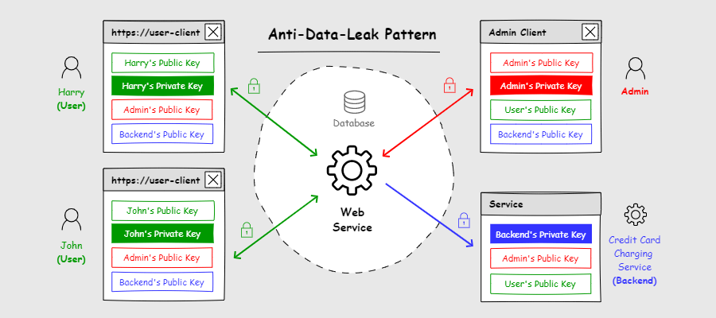
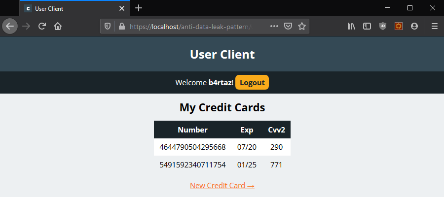
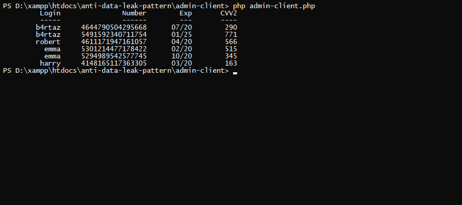

# Anti Data Leak Pattern



This repository is an example project for the article "Anti-Data-Leak Pattern for Web Services".

> (...) Current cloud services look similar; each has a database, which stores every sensitive data in plain text, credit card numbers, PIN codes, or personal ID numbers. To get all of this information, hackers must gain access to the database. Of course, this isn’t easy, but if they achieve it, they have every information that people sent to the service. The next significant weakness of this architecture is that many people can access the infrastructure. Developers, network administrators, back-up team, or cleaning staff, have access to the server room. That gives thousands of attack vectors.
> 
> With the help of asymmetric cryptography, we can alter many attack vectors, and make the theft of database resistant to data leak. (...)

[📰 Read the full article here](https://b4rtaz.github.io/blog/anti-data-leak-pattern)

**user-client** tested on:
* 💚 Mozilla Firefox (72.0.1)
* 💚 Chrome (79.0.3945.117)
* 👎 Microsoft Edge (44.17763.831.0) ([Edge doesn't support ECDH algorithm](https://diafygi.github.io/webcrypto-examples/)).

## Installation

* Install Apache + MariaDB + PHP 7.3+ (e.g. [XAMPP](https://www.apachefriends.org/index.html)).
* Install/activate [GMP](https://www.php.net/manual/en/book.gmp.php) extension for PHP.
	* For XAMPP you should uncomment the line `;extension=gmp` in `~/xampp/php/php.ini`.
* Install [Composer](https://getcomposer.org/).
* Install [NodeJS](https://nodejs.org/en/).
* Install Angular CLI.
	* `npm install -g @angular/cli`
* Download this repo to `~/htdocs/anti-data-leak-pattern` folder.
* Create a empty database `anti-data-leak-pattern`.
* Import the database structure from the file `database.sql`.
	* `mysql -u USERNAME -p anti-data-leak-pattern < database.sql`
* Install **web-service** dependencies.
	*  `cd web-service`
	* `composer install`
* Set your database user/password in `web-service/settings.php`.

```php
$settings = [
    # ...
    'db' => [
        'dsn' => 'mysql:host=localhost;dbname=anti-data-leak-pattern',
        'username' => 'USERNAME',
        'password' => 'PASSWORD'
    ],
    # ...
];
```

* Install **admin-client** dependencies.
	* `cd admin-client`
	* `composer install`
* Install **user-client** dependencies and build the client.
	* `cd user-client`
	* `npm install`
	* `npm run ng build`

## Run



To run **user-client** open the web browser and put the address: `https://localhost/anti-data-leak-pattern/user-client/dist/`. 

* If you have a certificate error you can ignore it. But remember, on the production you must have a valid SSL certificate!



To run **admin-client** enter:

* `cd admin-client`
* `php admin-client.php`
* If you have a certificate error (`SSL certificate problem: self signed certificate`) you can disable SSL verification. Set `verifySSL` to `false` in `admin-console/settings.php`. But remember, on the production you must have a valid SSL certificate!

## License

This project is released under the MIT license.
